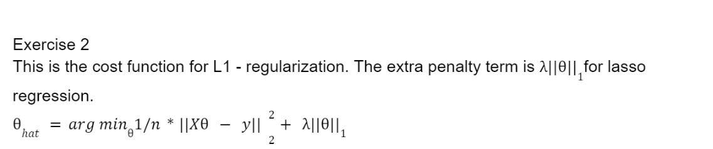

```{r setup, include=FALSE}
knitr::opts_chunk$set(echo = TRUE)
```

```{r}
tecator = read.csv("tecator.csv", header = T)
n = dim(tecator)[1]
set.seed(12345)
df = data.frame(tecator[c(2:102)])

id=sample(1:n, floor(n*0.5))
train = df[id,]
test = df[-id,]

fit = lm(Fat~ ., data = train)
coef(fit)
train_preds = predict(fit, train)
test_preds = predict(fit, test)
sum = summary(fit)

MSE_train=mean((train_preds - train$Fat)^2)
MSE_test=mean((test_preds - test$Fat)^2)
MSE_test
MSE_train
```
Comment on the quality of fit and prediction and therefore on the quality of model
 
If we calculate the mean square error of the training prediction vs the test prediction we see that we get extremely high error from test compare to training. This means that the model is very specific for the data that it is trained on. Which means that the quality of the model is not great for predicting other than particularity the trainig data.

Exercise 2
L1 (also called lasso) regression model 

L1 Cost function looks like this from the cours elitterature:





```{r, dev='png', fig.show='hide'}
library(glmnet)
y = train$Fat
x = train[1:100]
model_lasso= glmnet(as.matrix(x), as.matrix(y), alpha=1,family="gaussian")

plot(model_lasso, xvar = "lambda")
ynew=predict(model_lasso, newx=as.matrix(x), type="response")
```

What value of the penalty factor can be chosen if we want to select model with only three features?

From my interpretation, to select a model with 3 feature you need to pick a log-lambda value of -0.5.

Exercise 4
```{r}

y = train$Fat
x = train[1:100]
model_lasso= glmnet(as.matrix(x), as.matrix(y), alpha=0,family="gaussian")

plot(model_lasso, xvar = "lambda")
ynew=predict(model_lasso, newx=as.matrix(x), type="response")

```
You can not gather much information from ridge regression plot.


Exercise 5
```{r, warning=FALSE}


model_lasso= cv.glmnet(as.matrix(x), as.matrix(y), alpha=1,family="gaussian")
 

lambda_min = model_lasso$lambda.min
plot(model_lasso, xvar = "lambda")

better_model = glmnet(as.matrix(x), as.matrix(y), lambda = lambda_min, alpha = 1, family = "gaussian")

ynew=predict(better_model, newx=as.matrix(x), s = lambda_min , type="response")

plot(y, ylab = "y", col = "red", main = "Scatter plot")
points(ynew, col="blue")
```
The CV score increases as lambda increases, where around 0 the increase slows down.

We interpret that the lambda_min is the optimal lambda and uses a model of 9 features.

It would seem that they have the same amount of CV-score but the optmal lambda uses less model features.Therefor it would not generate significantly better predictions then lambda = -4.

Using the scatter plot we conclude that the predictions are very good where they predict almost in the same place as the original data.
